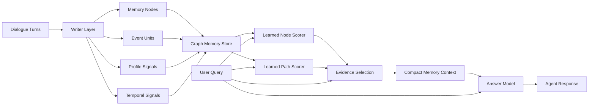

# TMCRA Long-Memory Runtime

[中文版本](README.zh-CN.md)

TMCRA is a graph-based long-memory runtime for agent systems. It helps an LLM retrieve, connect, and reason over long dialogue histories without exposing the full conversation context on every turn.

This repository contains a frozen TMCRA baseline package with model weights, runtime code snapshots, training metadata, and LongMemEval S500 benchmark results.

## What TMCRA Does

TMCRA adds a dedicated memory runtime between an agent application and its answer model.

At write time, TMCRA turns dialogue into memory nodes, event units, profile signals, and graph paths. This lets the system preserve not only isolated facts, but also relationships between facts across turns and sessions.

At retrieval time, TMCRA scores graph nodes and paths, selects compact evidence, and injects only the most relevant memory context into the answer model. The answer model still performs natural-language reasoning, while TMCRA handles long-memory organization, recall, and evidence surfacing.

The current runtime focuses on:

- user fact memory
- assistant-response memory
- profile and preference memory
- temporal memory
- cross-session graph tunneling
- learned node/path scoring
- compact evidence selection for downstream LLMs

## Algorithm Structure



The writer layer produces memory units from dialogue. The graph memory store preserves facts, events, profile signals, temporal signals, and cross-session links. The learned node/path scorers select relevant evidence for the current query, and the answer model uses that compact evidence to produce the final response.

## Why TMCRA

Long-running agents need more than simple vector recall. They need to preserve user facts, preferences, timeline changes, cross-session events, and multi-step evidence chains.

TMCRA organizes memory into graph nodes and learned retrieval paths, then surfaces compact evidence to the answer model. The goal is to let external agents use long-term memory through a runtime/API layer while keeping the memory algorithm and model weights independently deployable.

## How to Use

For inference/runtime use, load the graph scorer weights from:

```text
models/action_frame_tunnel_graph548_tunnel_fusion_train_20260524_042557/
```

The main runtime files are:

```text
node_scorer.pt
path_scorer.pt
export_manifest.json
```

A typical runtime configuration points TMCRA to these weights:

```bash
export TMCRA_NODE_MODEL_PATH="models/action_frame_tunnel_graph548_tunnel_fusion_train_20260524_042557/node_scorer.pt"
export TMCRA_PATH_MODEL_PATH="models/action_frame_tunnel_graph548_tunnel_fusion_train_20260524_042557/path_scorer.pt"
export TMCRA_RETRIEVAL_MODE="hybrid_node_scored"
export TMCRA_REQUIRE_LEARNED_SCORER="1"
```

The evaluation entrypoint snapshot is:

```text
code/run_lme_s10_native_tmcra.py
```

The core adapter snapshot is:

```text
code/memory_adapters.py
```

For a deployment build, load the two scorer files into the TMCRA adapter and point the agent's memory middleware to the TMCRA retrieval API. The answer model can be any OpenAI-compatible or local LLM endpoint; TMCRA supplies the selected memory evidence, and the answer model produces the final response.

## Dependency Environment

The included code snapshot is Python-based. A practical runtime environment should include:

- Python 3.10 or newer
- PyTorch, with CUDA recommended for model inference
- NumPy and standard Python data-processing libraries
- an OpenAI-compatible or local LLM endpoint for the answer layer and writer layer
- optional Git LFS support when pulling the full model package from GitHub

The benchmark scripts expect LongMemEval-format input data and write JSONL predictions and judge outputs. Runtime deployments can use the same model files without running the benchmark harness.

## Optional Modules

TMCRA also keeps optional extension points for retrieval and planning experiments. These modules can be enabled in deployment or evaluation builds when the target use case needs them.

- **Embedder interface**: an optional semantic embedding channel that can run alongside the graph-memory scorer. It is intended to provide additional dense semantic recall before or during graph evidence selection, without replacing the learned graph node/path scorers.
- **LLM planner interface**: an optional planner hook that can use an external LLM to organize evidence, expand query intent, or create an answer plan before the final answer call. This is useful for experiments and higher-cost deployments, while the default baseline keeps the core graph scorer path independently measurable.

These interfaces are integration points, not required dependencies for the frozen S500 baseline. They are designed so downstream deployments can decide whether to run a lighter scorer-only path or a heavier path with embedder/planner assistance.

## Included Artifacts

- `code/`: runtime and evaluation code snapshot for this baseline.
- `models/action_frame_tunnel_graph548_tunnel_fusion_train_20260524_042557/`: full trained graph-model output directory.
- `results/`: predictions, judge output, summary metrics, and compressed run artifacts.
- `docs/`: baseline record and result notes.

Additional documentation:

- `docs/BASELINE_S500_20260525.md`: benchmark record and subtask metrics.
- `docs/TRAINING.md`: model training direction and released training artifacts.

## Model Package

The included model package preserves the full training output for the graph scorer stack:

- `node_scorer.pt` and `path_scorer.pt`: runtime graph scoring weights.
- `node_scorer_best.pt` and `path_scorer_best.pt`: best checkpoint aliases.
- `node_scorer_last.pt` and `path_scorer_last.pt`: final training aliases.
- `checkpoints/`: epoch and step checkpoints.
- `export_manifest.json`, `train_summary.json`, and `train.log`: model metadata and training trace.

## Current Strengths

- Strong direct user-fact recall in single-session settings.
- Strong assistant-detail recall.
- Competitive knowledge-update behavior for changing facts.
- Working temporal and preference retrieval layers with clear room for further specialization.

## Active Improvement Areas

- Multi-session aggregation and unit coverage.
- Deeper time-graph reasoning.
- Preference-profile abstraction and cross-session tunneling.
- Query-graph to memory-graph matching for complex questions.

## Intended Use

This repository is a public-facing evidence package for TMCRA's long-memory runtime work. It is suitable for:

- Benchmark review.
- Model and result inspection.
- Reproducing the frozen baseline.
- Demonstrating how TMCRA can be packaged as an external memory runtime for agents.

## Benchmark Result

This package includes a full LongMemEval S500 run.

- Benchmark: LongMemEval S set, 500 samples
- Evaluation: official-compatible LongMemEval judge prompt
- Judge model: `gpt-4o`, resolved as `gpt-4o-2024-08-06`
- Writer layer used in this run: DeepSeek v4 Flash
- Answer layer used in this run: GPT5.4-compatible API
- Overall accuracy: `310 / 500 = 62.00%`

## Results by Task Type

| task type | accuracy | count |
| --- | ---: | ---: |
| single-session-user | 81.43% | 70 |
| single-session-assistant | 78.57% | 56 |
| knowledge-update | 70.51% | 78 |
| temporal-reasoning | 63.16% | 133 |
| single-session-preference | 56.67% | 30 |
| multi-session | 39.85% | 133 |

The benchmark outputs are available in:

```text
results/predictions.jsonl
results/judge_gpt4o_alias_vectorengine.jsonl
results/judge_gpt4o_alias_vectorengine.jsonl.summary.json
results/lme_s500_frozen_baseline38_full10_20260525_results.tar.gz
```
