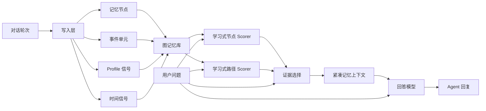

# TMCRA 长记忆运行时

[English version](README.md)

TMCRA 是面向 Agent 系统的图结构长记忆运行时。它帮助大语言模型在长对话历史中检索、连接和推理相关记忆，而不需要在每一轮都暴露完整上下文。

本仓库包含一个冻结的 TMCRA 基线包，包括模型权重、运行时代码快照、训练元数据和 LongMemEval S500 测评结果。

## TMCRA 的作用

TMCRA 在 Agent 应用和回答模型之间增加一层专门的记忆运行时。

在写入阶段，TMCRA 会把对话转成记忆节点、事件单元、profile 信号和图路径。这让系统不仅能保存孤立事实，也能保存不同轮次、不同会话之间的事实关系。

在召回阶段，TMCRA 会对图节点和路径进行打分，选择紧凑的证据，并只把最相关的记忆上下文注入给回答模型。回答模型仍然负责自然语言推理和最终表达，TMCRA 负责长记忆组织、召回和证据呈现。

当前运行时重点覆盖：

- 用户事实记忆
- 助手回答细节记忆
- profile 与偏好记忆
- 时间记忆
- 跨会话图隧穿
- 学习式节点/路径打分
- 面向下游 LLM 的紧凑证据选择

## 算法结构图



写入层从对话中生成记忆单元。图记忆库保存事实、事件、profile 信号、时间信号和跨会话连接。学习式节点/路径 scorer 会根据当前问题选择相关证据，回答模型使用这些紧凑证据生成最终回复。

## 为什么需要 TMCRA

长期运行的 Agent 不能只依赖简单向量召回。它需要保存用户事实、偏好、时间线变化、跨会话事件，以及多步证据链。

TMCRA 将记忆组织成图节点和学习得到的召回路径，再把压缩后的证据提供给回答模型。目标是让外部 Agent 可以通过运行时/API 层使用长期记忆，同时保持记忆算法和模型权重可以独立部署。

## 如何使用

推理或运行时使用时，加载下面目录中的图 scorer 权重：

```text
models/action_frame_tunnel_graph548_tunnel_fusion_train_20260524_042557/
```

主要运行时文件是：

```text
node_scorer.pt
path_scorer.pt
export_manifest.json
```

典型运行配置如下：

```bash
export TMCRA_NODE_MODEL_PATH="models/action_frame_tunnel_graph548_tunnel_fusion_train_20260524_042557/node_scorer.pt"
export TMCRA_PATH_MODEL_PATH="models/action_frame_tunnel_graph548_tunnel_fusion_train_20260524_042557/path_scorer.pt"
export TMCRA_RETRIEVAL_MODE="hybrid_node_scored"
export TMCRA_REQUIRE_LEARNED_SCORER="1"
```

测评入口代码快照：

```text
code/run_lme_s10_native_tmcra.py
```

核心适配器代码快照：

```text
code/memory_adapters.py
```

部署时，将两个 scorer 文件加载到 TMCRA adapter 中，并让 Agent 的记忆中间件调用 TMCRA 召回 API。回答模型可以是任意 OpenAI 兼容接口或本地 LLM；TMCRA 提供选中的记忆证据，回答模型生成最终回复。

## 依赖环境

当前代码快照基于 Python。建议运行环境包括：

- Python 3.10 或更高版本
- PyTorch，推荐使用 CUDA 做模型推理
- NumPy 及常见 Python 数据处理库
- 用于回答层和写入层的 OpenAI 兼容接口或本地 LLM endpoint
- 从 GitHub 拉取完整模型包时建议支持 Git LFS

benchmark 脚本使用 LongMemEval 格式输入数据，并输出 JSONL 格式的预测和 judge 结果。实际运行时部署可以直接使用同一套模型文件，不需要运行 benchmark harness。

## 可开启模块

TMCRA 当前也保留了用于召回和规划实验的可选接入口。部署或评估时，如果目标场景需要，可以按需开启这些模块。

- **Embedder 接入口**：可选的语义 embedding 通道，可以和图记忆 scorer 并行工作。它用于在图证据选择前或选择过程中提供额外的稠密语义召回，但不替代学习式图节点/路径 scorer。
- **LLM planner 接入口**：可选的规划 hook，可以调用外部 LLM 来整理证据、扩展 query intent，或在最终回答前生成 answer plan。它适合实验和更高成本的部署场景；默认基线仍保持核心图 scorer 链路可以独立测量。

这些接口是可集成的扩展点，不是冻结 S500 基线的必需依赖。下游部署可以根据成本和效果选择轻量的 scorer-only 路径，或开启 embedder/planner 辅助的增强路径。

## 包含内容

- `code/`：该基线使用的运行时和测评代码快照。
- `models/action_frame_tunnel_graph548_tunnel_fusion_train_20260524_042557/`：完整训练后的图模型输出目录。
- `results/`：预测结果、judge 输出、汇总指标和压缩后的运行结果。
- `docs/`：基线记录和结果说明。

补充文档：

- `docs/BASELINE_S500_20260525.md`：benchmark 记录和子任务指标。
- `docs/TRAINING.md`：模型训练方向和随包发布的训练产物说明。
- `docs/OPTIONAL_MODULES_AND_PARALLEL.md`：embedder/planner 可选接入口和并行评估推进方案。

## 模型包

随包发布的模型目录保留了图 scorer 栈的完整训练输出：

- `node_scorer.pt` 和 `path_scorer.pt`：运行时图打分权重。
- `node_scorer_best.pt` 和 `path_scorer_best.pt`：验证表现最好的 checkpoint 别名。
- `node_scorer_last.pt` 和 `path_scorer_last.pt`：训练结束时的 checkpoint 别名。
- `checkpoints/`：按 epoch 和 step 保存的中间 checkpoint。
- `export_manifest.json`、`train_summary.json` 和 `train.log`：模型元数据和训练轨迹。

## 当前优势

- 单会话直接用户事实召回较强。
- 助手细节召回较强。
- 对变化事实的 knowledge-update 任务有较稳定表现。
- 已具备可工作的时间记忆和偏好召回层，后续仍有专项优化空间。

## 当前改进方向

- multi-session 聚合和 unit coverage。
- 更深的时间图推理。
- 偏好 profile 抽象和跨会话隧穿。
- query graph 与 memory graph 的复杂问题匹配。

## 适用场景

本仓库是 TMCRA 长记忆运行时工作的对外展示包，适合用于：

- benchmark 审阅
- 模型和结果检查
- 复现冻结基线
- 展示 TMCRA 如何作为外部 Agent 的记忆运行时进行封装

## Benchmark 结果

本包包含一次完整 LongMemEval S500 测试。

- Benchmark：LongMemEval S set，500 条样本
- Evaluation：official-compatible LongMemEval judge prompt
- Judge 模型：`gpt-4o`，解析为 `gpt-4o-2024-08-06`
- 本轮使用的写入层：DeepSeek v4 Flash
- 本轮使用的回答层：GPT5.4-compatible API
- 总准确率：`310 / 500 = 62.00%`

## 各任务类型结果

| 任务类型 | 准确率 | 数量 |
| --- | ---: | ---: |
| single-session-user | 81.43% | 70 |
| single-session-assistant | 78.57% | 56 |
| knowledge-update | 70.51% | 78 |
| temporal-reasoning | 63.16% | 133 |
| single-session-preference | 56.67% | 30 |
| multi-session | 39.85% | 133 |

benchmark 输出文件位于：

```text
results/predictions.jsonl
results/judge_gpt4o_alias_vectorengine.jsonl
results/judge_gpt4o_alias_vectorengine.jsonl.summary.json
results/lme_s500_frozen_baseline38_full10_20260525_results.tar.gz
```
